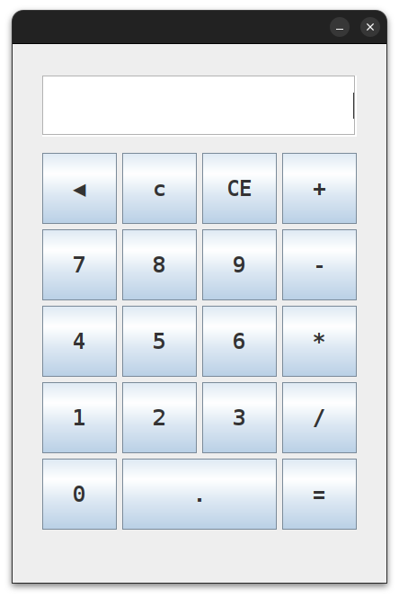

# Calculatrice en Java avec Netbeans

## Description
Ce projet est une calculatrice simple et fonctionnelle, développée en Java en utilisant l'environnement NetBeans. Elle permet d'effectuer des opérations mathématiques de base, comme l'addition, la soustraction, la multiplication, et la division. L'interface graphique (GUI) a été conçue à l'aide de l'outil de glisser-déposer de NetBeans.

## Fonctionnalités
- Addition

- Soustraction

- Multiplication

- Division

- Effacement du dernier chiffre (fonction "Backspace")

- Réinitialisation de l'écran (Clear)

## Image 1.0


## Technologies Utilisées
- Langage de programmation : Java

- IDE : NetBeans

- Bibliothèque graphique : Swing

## Installation
- Clonez ce dépôt sur votre machine locale :

    ```git clone https://github.com/Therax1/CalculatriceinJava-Netbeans-.git```

- Ouvrez le projet dans NetBeans.

- Compilez et exécutez le projet.

## Fonctionnalités principales dans le code :

- Saisie des chiffres :
    ```
    private void EnterNumbers(String q) {
    String Nums = Screen.getText() + q;
    Screen.setText(Nums);
    } 
    ```
- Backspace :
    ```private void backspaceActionPerformed(java.awt.event.ActionEvent evt) {
    String backSp = null;
    if (Screen.getText().length() > 0) {
        StringBuilder sb = new StringBuilder(Screen.getText());
        sb.deleteCharAt(Screen.getText().length() - 1);
        backSp = sb.toString(); 
        Screen.setText(backSp);
    }}
    ```
- Gestion des opérations :
    ```Number1 = Double.parseDouble(Screen.getText());
    Screen.setText("");
    Op = "+"; // Exemple pour l'addition 
    ```

## Améliorations possibles

- Ajouter plus d'opérations avancées.

- Améliorer le design de l'interface graphique.

## Auteur

- Nom : Thérance
- GitHub : [Therax1](https://github.com/Therax1)

## Licence

Ce projet est sous licence MIT. Vous êtes libre de l'utiliser, de le modifier et de le redistribuer.
